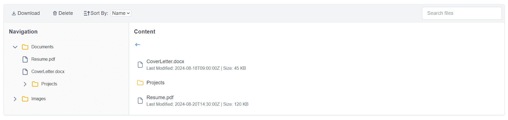

# Overview

The `FileManager` component for Qodly Studio provides a comprehensive file management interface. It allows users to navigate, view, and manage a hierarchical structure of files and folders directly within the Qodly Studio environment. The component supports searching, sorting, enhancing the overall file management experience.

## FileManager

A robust file management component with advanced navigation and file operations.

### Datasource

| Name       | Type             | Required | Description                                                                                                                                                        |
| ---------- | ---------------- | -------- | ------------------------------------------------------------------------------------------------------------------------------------------------------------------ |
| Datasource | array of objects | Yes      | The component expects an array of file and folder objects. Each object must have properties defining its type (file or folder), name, size, and lastModified date. |
|            |

**Some examples of data in this case:**
[{"name":"Documents","type":"folder","children":[{"name":"Resume.pdf","type":"file","lastModified":"2024-08-20T14:30:00Z","size":120},{"name":"CoverLetter.docx","type":"file","lastModified":"2024-08-18T09:00:00Z","size":45},{"name":"Projects","type":"folder","children":[{"name":"Project1","type":"folder","children":[{"name":"Project1_Document.pdf","type":"file","lastModified":"2024-08-15T11:00:00Z","size":200}]},{"name":"Project2","type":"folder","children":[]}]}]},{"name":"Images","type":"folder","children":[{"name":"Vacation.jpg","type":"file","lastModified":"2024-07-25T10:00:00Z","size":3000}]}]
